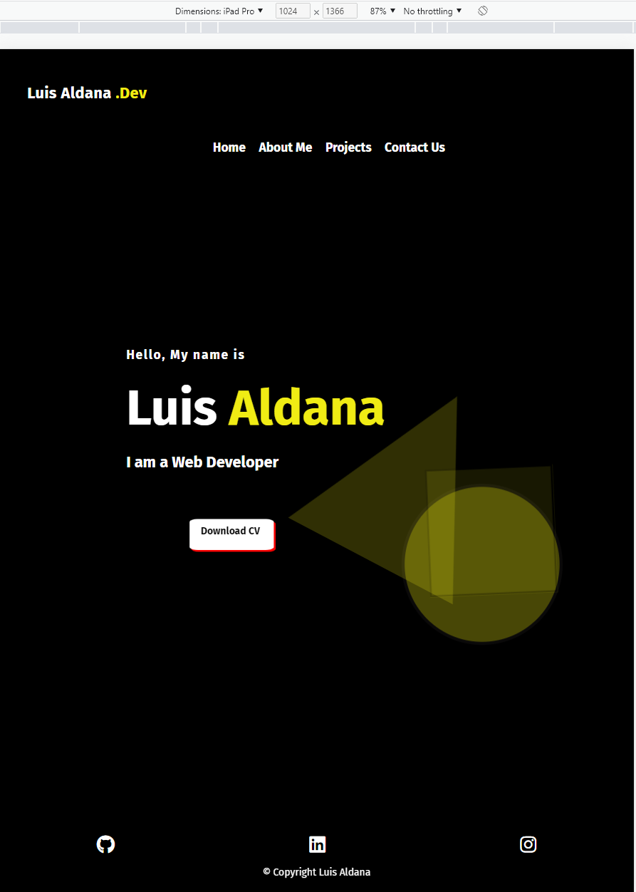
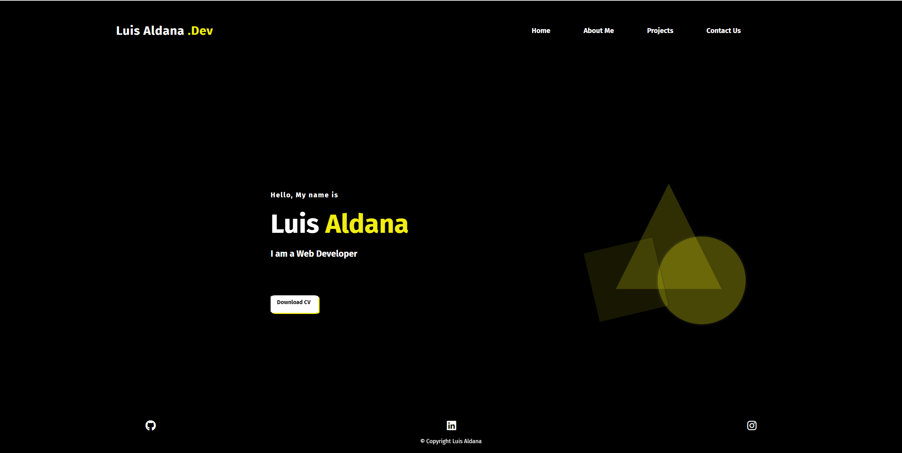

# Luis Aldana - Portfolio

## **Links**

Deployed using Netlify: https://luisdevelops.com/

Github Repository:

Youtube Link for presentation video:
  

## Purpose, Target and Functionalities

 
The primary objective of this website is to present my technical and professional skills to potential employers or individuals seeking to hire a web developer for their projects. Through this platform, visitors will gain insights into my personal and professional background and have the opportunity to evaluate my abilities, which I have acquired through the Coder Academy bootcamp. Additionally, the website contains a submission form that allows visitors to reach out to me with inquiries or project proposals.

In the development of this website, I aimed to capture visitors' attention by incorporating engaging features such as animations, an interactive navigation bar, and appealing colors, all of which enhance the user's experience. Visitors can learn more about me, including my origins, hobbies, and interests, as well as review my projects and interact with them. If visitors wish to contact me, they can utilize the links provided in the footer icons to access my social media accounts or submit an inquiry through the Contact page.

## Tech Stack:

This Website was designed and styled it using:

## _HTML, CSS and SCSS_

Deployed with Netlify.

## Screenshots  

|
Screenshot of the Website Diagram. Created in Diagrams.net.

|
Screenshot of the Website in Mobile view.

|
Screenshot of the Website in Tablet view.

|
Screenshot of the Website in Desktop view

|
Screenshot of the Home Page Mockup

|
Screenshot of the About me Page Mockup

|
Screenshot of the Project Page Mockup

|
Screenshot of the Contact Page Mockup

## References

Social media Icons: "https://fontawesome.com/"

Blogs images: "https://www.Pinterest.com"

Animation for home page inspired using: https://www.w3schools.com/
